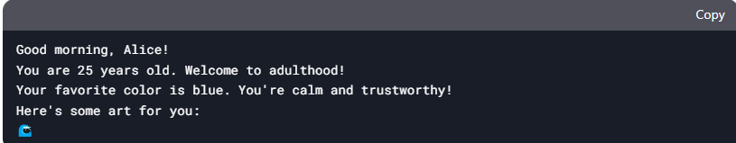

# Cool Profile Creator
Welcome to the Cool Profile Creator! This Python program allows you to create a personalized profile with your name, age, and favorite color. It also provides fun facts, personality traits, and even ASCII art based on your inputs. The program is interactive and includes an option to edit your profile.

## Features
**Personalized Greeting: Greets you based on the time of day.**

**Age-Based Fun Fact: Provides a fun fact based on your age.**

**Color-Based Personality Trait: Gives you a quirky personality trait based on your favorite color.**

**ASCII Art: Displays cool ASCII art related to your favorite color. The ASCII art for each color is stored in the Arts.txt**

**Interactive Menu: Allows you to view or edit your profile.**


# RUN
```bash
python3 profile_creator.py
```

# TEST
```bash
python3 -m unittest tests/test_profile_creator.py
```
# OUTPUT
